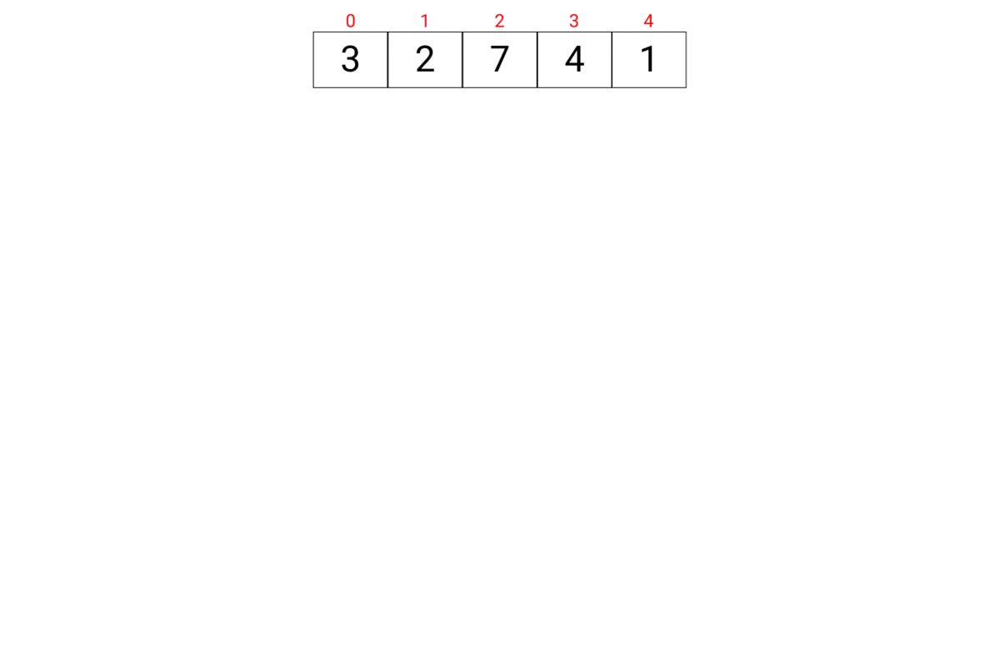

# Linked List

> Merge Sort is a Divide and Conquer algorithm. It divides the input array into two halves, calls itself for the two halves, and then merges the two sorted halves. - [GeeksForGeeks](https://www.geeksforgeeks.org/data-structures/linked-list/)

## Visual Representation

## Test

Test codes, which are associated to the linked list, are can be found in `test/merge_sort.test.dart`

## Time Complexity Table

| Process| Time Complexity
| :---: | :---: |
| Sorting | O(nLogn) |