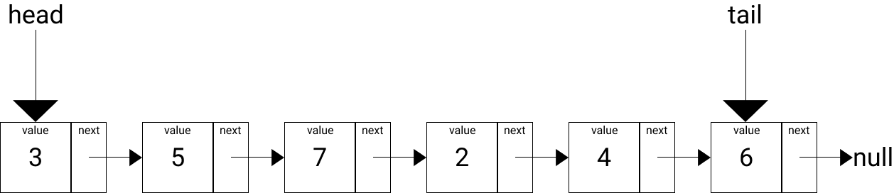

# Linked List

> Linked list is a linear data structure, in which the elements are not stored at contiguos memory locations. The emelents in a linked list are linked using pointers. - [GeeksForGeeks](https://www.geeksforgeeks.org/data-structures/linked-list/)

## Visual Representation

## Test

Test codes, which are associated to the linked list, are can be found in `test/linked_list.test.dart`

## Time Complexity Table

| Process| Time Complexity
| :---: | :---: |
| Append | O(1) |
| Prepend | O(1) |
| Insert | B.C. O(1) / W.C. O(n) |
| Delete | B.C. O(1) / W.C. O(n) |
| Get | B.C. O(1) / W.C. O(n) |
| Length | O(n) |

PS: B.C. is a reference for best case, W.C. is a reference for worst case.